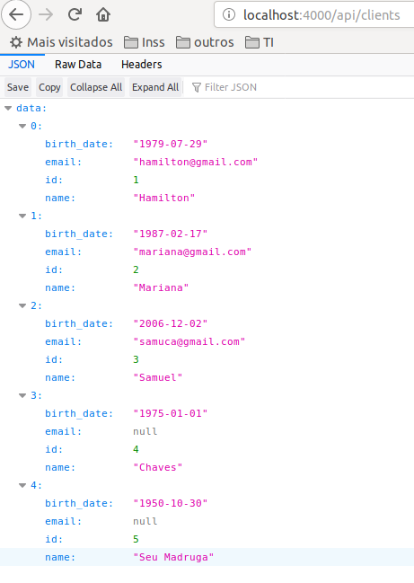

# WRK
wrk -t12 -c400 -d30s http://localhost:5000/v1/clients

# BENCHMARK



| lang                | app      | init memory | 12 threads and 400 http connections |
| ------------------- | -------- | ------------| ----------------------------------  |
| 1 kotlin + springboot | clientsb |  574mb      | 759.3mb ->  see 1                   |
| 2 elixir + phoenix    | clientex |  203mb      | 287.3mb ->  see 2                   |
| 3 python              | TODO     |             |                                     |
| 4 javascript + nodejs | TODO     |             |                                     |
| 5 rust                | TODO     |             |                                     |
| 6 go                  | TODO     |             |                                     |
| 7 clojure             | TODO     |             |                                     |


1. SpringBoot + Kotlin with 12 threads and 400 http connections
```   
Thread Stats   Avg      Stdev     Max   +/- Stdev   
    Latency    83.22ms  158.97ms   2.00s    93.98%   
    Req/Sec   337.30    101.43   595.00     69.84%  
  118344 requests in 30.10s, 53.72MB read   
  Socket errors: connect 0, read 0, write 0, timeout 111   
Requests/sec:   3932.11   
Transfer/sec:      1.78MB   
```

2. Elixir + Phoenix with 12 threads and 400 connections
```
  Thread Stats   Avg      Stdev     Max   +/- Stdev
    Latency    25.38ms    5.14ms  81.21ms   72.23%
    Req/Sec     1.31k    91.74     1.78k    78.83%
  468782 requests in 30.09s, 119.45MB read
  Non-2xx or 3xx responses: 468782
Requests/sec:  15577.89
Transfer/sec:      3.97MB
```